# Credit Risk Analysis
## Overview of Analysis
Credit risk is an inherently unbalanced classification problem, as good loans easily outnumber risky loans. Therefore, we employ different techniques to train and evaluate models with unbalanced classes. Using the credit card credit dataset from LendingClub, a peer-to-peer lending services company, we oversample the data using the RandomOverSampler and SMOTE algorithms, and undersample the data using the ClusterCentroids algorithm. Then, we use a combinatorial approach of over- and undersampling using the SMOTEENN algorithm. Next, we compare two new machine learning models that reduce bias, BalancedRandomForestClassifier and EasyEnsembleClassifier, to predict credit risk. Ultimately we evaluate the performance of these models and find the find the best model to predict credit risk.

## Results
### Naive Random Oversampling:
- Balanced accuracy score: 62.94%
- Precision High Risk: 1%
- Precision Low Risk: 100%
- Recall High Risk: 57%
- Recall Low Risk: 68%

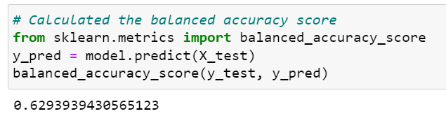

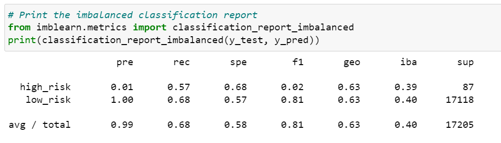

### SMOTE Oversampling:
- Balanced accuracy score: 62.77%
- Precision High Risk: 1%
- Precision Low Risk: 100%
- Recall High Risk: 62%
- Recall Low Risk: 63%

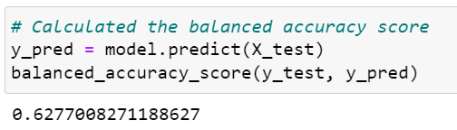

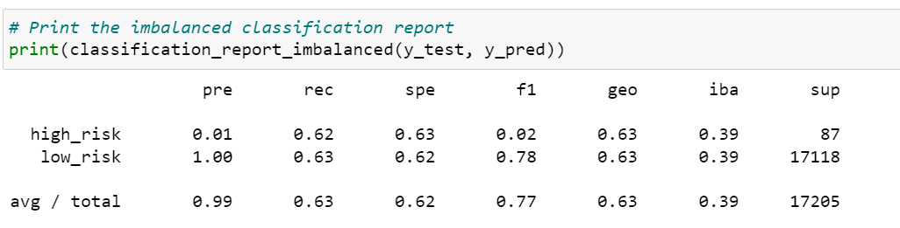

### Cluster Cetroids Undersampling:
- Balanced accuracy score: 62.77%
- Precision High Risk: 1%
- Precision Low Risk: 100%
- Recall High Risk: 59%
- Recall Low Risk: 46%

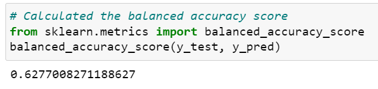

### SMOTEEN Combination (Over and Under) Sampling:
- Balanced accuracy score: 52.13%
- Precision High Risk: 1%
- Precision Low Risk: 100%
- Recall High Risk: 70%
- Recall Low Risk: 58%

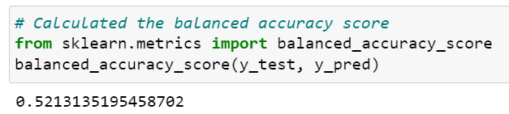

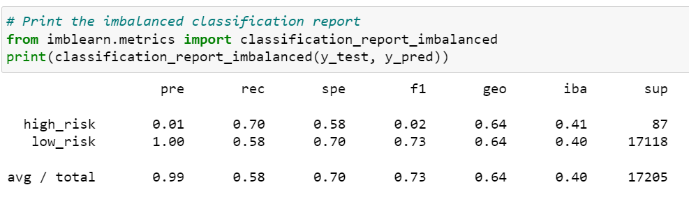

### Balanced Random Forest Classifier:
- Balanced accuracy score: 78.78%
- Precision High Risk: 4%
- Precision Low Risk: 100%
- Recall High Risk: 67%
- Recall Low Risk: 91%

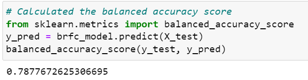

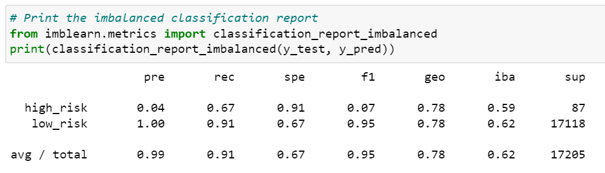

### Easy Ensemble AdaBoost Classifier:
- Balanced accuracy score: 92.54%
- Precision High Risk: 7%
- Precision Low Risk: 100%
- Recall High Risk: 91%
- Recall Low Risk: 94%

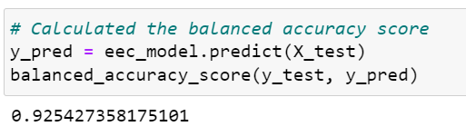

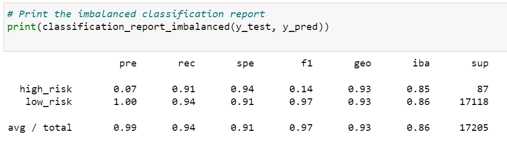

## Summary
Based on the 6 models, the Easy Ensemble AdaBoost Classifier yields the best results.  This model has an accuracy score of 92.54% and a precision rate of 7%.  As a result, I recommend this model for this type of analysis.

